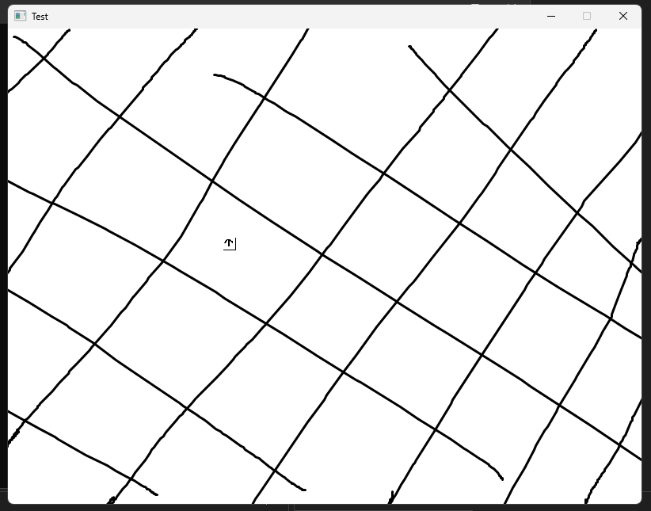

# PixelEngine
A work in progress project to emulate the feel of the Gameboy Advance Pokemon Games.
Just for practice.

 
<label for="screenshot1">WIP Screenshot, testing a movement component and background component</label>

### Notes
Made using OpenGL and GLAD. Rendering pixel-by-pixel to a quad the size of the window.

## Features
Currently very Object-Orientated with the Entity and Components. I would like to implement a more data orientated approach in the near future.

- Sprites rendering from a sprite sheet and an image file. Supports transparency.
- InputHandler
- Scenes

## Yet To Be Implemented or Wanted To Be Implemented
- Scripting Support
- A proper ECS